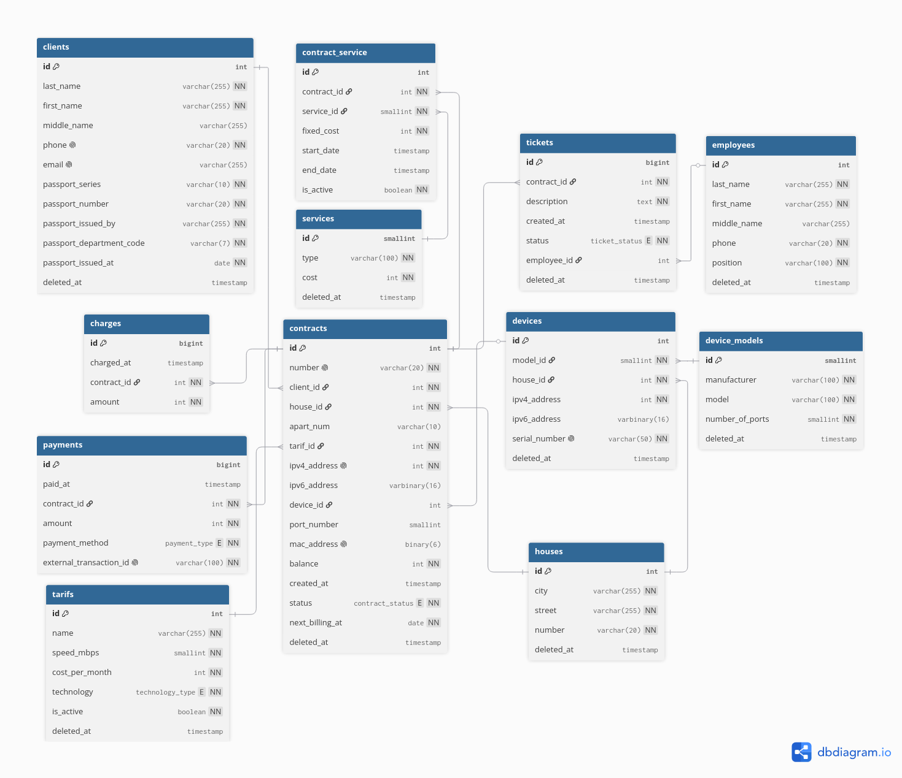

# Документация базы данных провайдера интернет-услуг (ISP)

## Схема базы данных (ER-диаграмма)



```dbml
// ==========================================
// ПЕРЕЧИСЛЕНИЯ (ENUMS)
// ==========================================

Enum technology_type {
  "FTTB"
  "GPON"
  "ADSL"
  "Wireless"
}

Enum contract_status {
  "Активен"
  "Заблокирован (Баланс)"
  "Приостановлен (Добровольно)"
  "Расторгнут"
}

Enum payment_type {
  "Банковская карта"
  "СБП (Система быстрых платежей)"
  "Наличные в офисе"
  "Обещанный платеж"
}

Enum ticket_status {
  "Открыт"
  "В работе"
  "Ожидает ответа клиента"
  "Решен"
  "Закрыт"
}

// ==========================================
// ТАБЛИЦЫ
// ==========================================

Table clients {
  id int [pk, increment]
  last_name varchar(255) [not null]
  first_name varchar(255) [not null]
  middle_name varchar(255)
  phone varchar(20) [not null, unique]
  email varchar(255) [unique]
  passport_series varchar(10) [not null]
  passport_number varchar(20) [not null]
  passport_issued_by varchar(255) [not null]
  passport_department_code varchar(7) [not null, note: 'В формате ХХХ-ХХХ']
  passport_issued_at date [not null]
  deleted_at timestamp

  indexes {
    (passport_series, passport_number) [unique]
  }
}

Table houses {
  id int [pk, increment]
  city varchar(255) [not null]
  street varchar(255) [not null]
  number varchar(20) [not null]
  deleted_at timestamp
}

Table tarifs {
  id int [pk, increment]
  name varchar(255) [not null]
  speed_mbps smallint [not null]
  cost_per_month int [not null, note: 'В копейках']
  technology technology_type [not null, note: 'Учебное допущение: ENUM вместо справочника']
  is_active boolean [not null, default: true]
  deleted_at timestamp
}

Table employees {
  id int [pk, increment]
  last_name varchar(255) [not null]
  first_name varchar(255) [not null]
  middle_name varchar(255)
  phone varchar(20) [not null]
  position varchar(100) [not null, note: 'Должность хранится обычным текстом']
  deleted_at timestamp
}

Table device_models {
  id smallint [pk, increment]
  manufacturer varchar(100) [not null]
  model varchar(100) [not null]
  number_of_ports smallint [not null]
  deleted_at timestamp
}

Table devices {
  id int [pk, increment]
  model_id smallint [not null]
  house_id int [not null]
  ipv4_address int [not null, note: 'Хранится через INET_ATON']
  ipv6_address varbinary(16)
  serial_number varchar(50) [not null, unique]
  deleted_at timestamp
}

Table contracts {
  id int [pk, increment]
  number varchar(20) [not null, unique]
  client_id int [not null]
  house_id int [not null]
  apart_num varchar(10)
  tarif_id int [not null]
  ipv4_address int [not null, unique]
  ipv6_address varbinary(16)
  device_id int
  port_number smallint
  mac_address binary(6) [unique]
  balance int [not null, default: 0, note: 'В копейках']
  created_at timestamp
  status contract_status [not null, note: 'Учебное допущение: ENUM вместо справочника']
  next_billing_at date [not null]
  deleted_at timestamp
}

Table payments {
  id bigint [pk, increment]
  paid_at timestamp
  contract_id int [not null]
  amount int [not null, note: 'В копейках']
  payment_method payment_type [not null, note: 'Учебное допущение: ENUM вместо справочника']
  external_transaction_id varchar(100) [not null, unique]
}

Table charges {
  id bigint [pk, increment]
  charged_at timestamp
  contract_id int [not null]
  amount int [not null, note: 'В копейках']
}

Table tickets {
  id bigint [pk, increment]
  contract_id int [not null]
  description text [not null]
  created_at timestamp
  status ticket_status [not null, note: 'Учебное допущение: ENUM вместо справочника']
  employee_id int
  deleted_at timestamp
}

Table services {
  id smallint [pk, increment]
  type varchar(100) [not null]
  cost int [not null, note: 'В копейках']
  deleted_at timestamp
}

Table contract_service {
  id int [pk, increment]
  contract_id int [not null]
  service_id smallint [not null]
  fixed_cost int [not null, note: 'Фиксация стоимости на момент подключения (в копейках)']
  start_date timestamp
  end_date timestamp
  is_active boolean [not null, default: true]
}

// ==========================================
// СВЯЗИ (ВНЕШНИЕ КЛЮЧИ)
// ==========================================

Ref: devices.model_id > device_models.id
Ref: devices.house_id > houses.id

Ref: contracts.client_id > clients.id
Ref: contracts.house_id > houses.id
Ref: contracts.tarif_id > tarifs.id
Ref: contracts.device_id > devices.id

Ref: payments.contract_id > contracts.id [delete: cascade]
Ref: charges.contract_id > contracts.id [delete: cascade]

Ref: tickets.contract_id > contracts.id [delete: cascade]
Ref: tickets.employee_id > employees.id [delete: set null]

Ref: contract_service.contract_id > contracts.id [delete: cascade]
Ref: contract_service.service_id > services.id
```

## Архитектурные допущения (Важно)

В рамках проектирования было принято осознанное решение использовать тип данных `ENUM` для ряда полей (технологии подключения в тарифах, статусы договоров, способы оплаты, статусы заявок) вместо создания отдельных таблиц-справочников. 

Это связано с тем, что данный проект является учебным. Если вынести все статусы и типы в независимые таблицы, схема базы данных разрастется до 19 таблиц. Как было отмечено преподавателем, для масштаба текущего задания это уже перебор. Оставление `ENUM` обеспечивает оптимальный баланс: мы показываем владение разными типами данных и при этом не перегружаем структуру избыточными связями.

---

## 1. Описание структуры таблиц

Проект базы данных состоит из 12 таблиц, которые можно логически разделить на справочники, основные бизнес-сущности и транзакционные/исторические данные. В большинстве таблиц реализован механизм "мягкого удаления" (Soft Delete) через поле `deleted_at`, что позволяет сохранять ссылочную целостность исторических данных при удалении объектов.

### Базовые справочники и независимые сущности

* **`clients` (Клиенты)**
    * **Назначение:** Хранение персональных данных абонентов (ФИО, контакты, паспортные данные).
    * **Ключевые особенности:** Уникальные индексы на телефон, email и связку серия+номер паспорта для предотвращения дублей.

* **`houses` (Адресный фонд)**
    * **Назначение:** Справочник домов, подключенных к сети провайдера.
    * **Ключевые особенности:** Составной индекс по городу, улице и номеру дома для быстрого поиска.

* **`tarifs` (Тарифные планы)**
    * **Назначение:** Каталог доступных тарифов на доступ в интернет.
    * **Ключевые особенности:** Стоимость (`cost_per_month`) хранится в копейках (`INT UNSIGNED`) для избежания ошибок округления и проблем с плавающей точкой. Тип технологии подключения (`technology`) хранится в виде `ENUM`.

* **`employees` (Сотрудники)**
    * **Назначение:** Данные персонала (монтажники, операторы, админы).
    * **Ключевые особенности:** Должность (`position`) хранится текстом для простоты схемы.

* **`device_models` (Модели оборудования)**
    * **Назначение:** Справочник типов коммутаторов и роутеров с указанием количества портов.

* **`services` (Дополнительные услуги)**
    * **Назначение:** Справочник разовых или периодических услуг (Антивирус, статический IP и т.д.).

### Основные сущности и инфраструктура

* **`devices` (Оборудование на узлах связи)**
    * **Назначение:** Учет физических коммутаторов, установленных в домах.
    * **Ключевые особенности:** Поля `ipv4_address` хранятся в формате `INT UNSIGNED` (используется функция `INET_ATON`) для экономии места и скорости поиска.

* **`contracts` (Договоры)**
    * **Назначение:** Центральная таблица биллинга. Связывает абонента, адрес, тариф, оборудование и содержит текущий баланс.
    * **Ключевые особенности:** Хранит выданные IP и MAC-адреса абонентов (MAC в формате `BINARY(6)`). Статус договора реализован через `ENUM`. Содержит дату следующего списания абонентской платы (`next_billing_at`).

### Транзакционные сущности (Связующие и история)

* **`contract_service` (Подключенные услуги)**
    * **Назначение:** Связующая таблица (Pivot) для связи договоров и дополнительных услуг (Многие-ко-Многим).
    * **Ключевые особенности:** Хранит историческую стоимость услуги на момент подключения (`fixed_cost`).

* **`payments` (Платежи)**
    * **Назначение:** Журнал поступлений денежных средств на лицевые счета (договоры).
    * **Ключевые особенности:** Строгая связь с договором (`ON DELETE CASCADE`), уникальный идентификатор внешней транзакции. Способ оплаты (`payment_method`) реализован через `ENUM`.

* **`charges` (Списания)**
    * **Назначение:** Журнал списаний абонентской платы по договорам.

* **`tickets` (Заявки в техподдержку)**
    * **Назначение:** Обращения абонентов с привязкой к договору и назначенному сотруднику.
    * **Ключевые особенности:** Статус тикета (`status`) реализован через `ENUM`.

---

## 2. Связи между таблицами (ER-модель)

Структура базы данных нормализована до 3НФ (с описанными выше допущениями для `ENUM` полей). Основные связи между таблицами реализованы через внешние ключи (`FOREIGN KEY`).

### Связи 1:M (Один-ко-Многим)

Большинство связей в системе имеют классический тип "Один-ко-Многим":

1.  **`clients` → `contracts`:** У одного клиента (физлица) может быть несколько оформленных договоров (например, в разных квартирах).
2.  **`houses` → `contracts`:** К одному дому привязано множество договоров абонентов.
3.  **`tarifs` → `contracts`:** Один тарифный план используется во множестве договоров.
4.  **`device_models` → `devices`:** Модель оборудования описывает множество физических устройств.
5.  **`houses` → `devices`:** В одном доме может быть установлено несколько коммутаторов.
6.  **`devices` → `contracts`:** К одному коммутатору провайдера подключено множество договоров (абонентов). Триггер на уровне БД контролирует, чтобы количество договоров не превысило лимит портов модели.
7.  **`contracts` → `payments`:** По одному договору может быть неограниченное число платежей.
8.  **`contracts` → `charges`:** По одному договору ежемесячно формируются записи о списаниях.
9.  **`contracts` → `tickets`:** Один абонент (договор) может создать множество обращений в саппорт.
10. **`employees` → `tickets`:** Один сотрудник обрабатывает множество заявок. Если сотрудник удаляется, поле `employee_id` в тикете принимает значение `NULL` (`ON DELETE SET NULL`), чтобы не потерять историческую заявку.

### Связи M:M (Многие-ко-Многим)

Связь между договорами и дополнительными услугами реализована по паттерну "Многие-ко-Многим" через промежуточную (Pivot) таблицу `contract_service`:

* **`contracts` ← `contract_service` → `services`**
    * Один договор может включать несколько дополнительных услуг (например, IPTV и статический IP).
    * Одна услуга подключается ко множеству различных договоров.
    * Промежуточная таблица позволяет фиксировать дату начала/конца действия услуги и её стоимость для конкретного абонента, не затрагивая основной справочник услуг.

## 3. Типовые операции и бизнес-процессы

### 3.1. Жизненный цикл абонента (CRM)

**Регистрация нового абонента**
Процесс состоит из двух шагов: добавление физического лица и оформление на него договора с выделением порта на оборудовании. При вставке договора сработает триггер `trg_before_contract_insert`, который прервет транзакцию, если на выбранном коммутаторе (`device_id`) закончились свободные порты.

```sql
-- Шаг 1: Добавляем профиль клиента
INSERT INTO `clients` (
    `last_name`, `first_name`, `phone`, `passport_series`, 
    `passport_number`, `passport_issued_by`, `passport_department_code`, `passport_issued_at`
) VALUES (
    'Смирнов', 'Илья', '+79998887766', '4520', 
    '112233', 'МВД РОССИИ', '770-001', '2020-01-15'
);

-- Шаг 2: Создаем договор (предположим, клиенту присвоен id = 6)
INSERT INTO `contracts` (
    `number`, `client_id`, `house_id`, `apart_num`, `tarif_id`, 
    `ipv4_address`, `device_id`, `port_number`, `mac_address`, 
    `status`, `next_billing_at`
) VALUES (
    '100-006', 6, 1, '15', 1, 
    INET_ATON('100.64.1.106'), 1, 16, UNHEX('A1B2C3D4E506'), 
    'Активен', '2023-11-20'
);

```

**Редактирование профиля (изменение номера телефона)**

```sql
UPDATE `clients` 
SET `phone` = '+70001112233' 
WHERE `id` = 6 
LIMIT 1;

```

**Расторжение договора (Мягкое удаление)**
Мы не удаляем запись физически (`DELETE`), чтобы не сломать историю платежей и заявок. Мы меняем статус и проставляем дату удаления.

```sql
UPDATE `contracts` 
SET 
    `status` = 'Расторгнут', 
    `deleted_at` = NOW() 
WHERE `id` = 6 
LIMIT 1;

```

### 3.2. Биллинг и финансы

**Поступление платежа от абонента**
Оператору или внешней системе достаточно просто вставить запись о платеже. Триггер `trg_after_payment_insert` сам прибавит сумму к полю `balance` в таблице `contracts` и, если баланс стал положительным, автоматически переведет статус договора из «Заблокирован» в «Активен».

```sql
INSERT INTO `payments` (
    `contract_id`, `amount`, `payment_method`, `external_transaction_id`
) VALUES (
    2, 65000, 'СБП (Система быстрых платежей)', 'TXN-SBP-9999'
);

```

**Списание ежемесячной абонентской платы**
Выполняется вызовом хранимой процедуры. Процедура сама высчитывает стоимость тарифа и доп. услуг через функцию `fn_get_full_monthly_cost`, списывает деньги, создает запись в `charges`, сдвигает дату `next_billing_at` на месяц вперед и блокирует абонента, если он ушел в минус.

```sql
CALL sp_process_monthly_billing(1);

```

**Смена тарифного плана**

```sql
UPDATE `contracts` 
SET `tarif_id` = 3 -- Перевод на тариф "Гигабит PRO"
WHERE `id` = 1 
LIMIT 1;

```

### 3.3. Управление дополнительными услугами

**Подключение статического IP-адреса**
Вставляем запись в связующую таблицу. Стоимость (`fixed_cost`) фиксируется на момент подключения, чтобы при глобальном изменении цен в справочнике `services`, у старых абонентов цена не изменилась (пока они не переподключат услугу).

```sql
INSERT INTO `contract_service` (
    `contract_id`, `service_id`, `fixed_cost`, `is_active`
) VALUES (
    1, 1, 15000, TRUE
);

```

**Отключение услуги**

```sql
UPDATE `contract_service` 
SET 
    `is_active` = FALSE, 
    `end_date` = NOW() 
WHERE `contract_id` = 1 AND `service_id` = 1 AND `is_active` = TRUE 
LIMIT 1;

```

### 3.4. Работа технической поддержки (Helpdesk)

**Регистрация инцидента абонентом**

```sql
INSERT INTO `tickets` (`contract_id`, `description`, `status`) 
VALUES (4, 'Постоянные обрывы соединения вечером', 'Открыт');

```

**Взятие заявки в работу инженером**
Назначаем сотрудника (`employee_id = 1`) и меняем статус.

```sql
UPDATE `tickets` 
SET 
    `employee_id` = 1, 
    `status` = 'В работе' 
WHERE `id` = 5 
LIMIT 1;

```

**Закрытие заявки**

```sql
UPDATE `tickets` 
SET `status` = 'Решен' 
WHERE `id` = 5 
LIMIT 1;

```

### 3.5. Сетевая инфраструктура и Аналитика

Операции чтения (`SELECT`), инкапсулированные в представления (Views) для удобства конечных пользователей и интеграции с дашбордами.

**Поиск коммутаторов со свободными портами (для монтажников)**
Позволяет быстро понять, можно ли подключить нового абонента в конкретном доме.

```sql
SELECT 
    `installation_address`, 
    `equipment_model`, 
    `free_ports` 
FROM `v_network_equipment_utilization` 
WHERE `free_ports` > 0;

```

**Выгрузка списка должников (для автоинформатора или отдела взыскания)**
Выводит всех абонентов со статусом «Заблокирован», их долг и ежемесячный платеж.

```sql
SELECT 
    `contract_number`, 
    `client_name`, 
    `phone`, 
    `current_debt` 
FROM `v_billing_debtors`;

```
